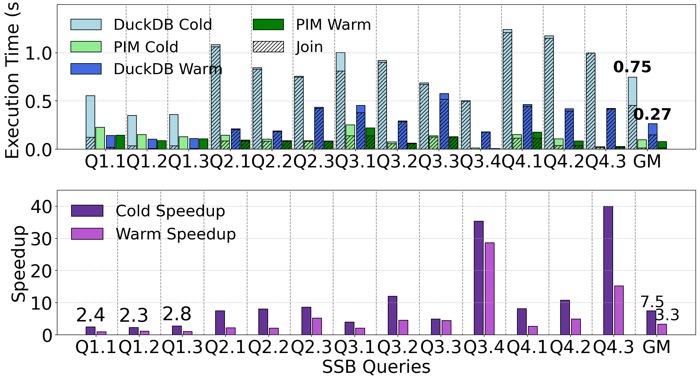

# Figure 11 with SPARQ's CPU work on one socket's memory

Figure 11 models each SPARQ-integrated query as

    SPARQ bar = DuckDB − DuckDB join + SPARQ join            (Section 5.2.5)

Here both bars are re-measured with DuckDB v1.1.3 on 2026-09-16:

- **DuckDB bars:** an unbound run (no NUMA binding, all 112 threads), with the
  join portion computed from that run.
- **SPARQ bars:** bound DuckDB − bound DuckDB join + SPARQ join, where the bound
  run has its memory on one socket's 8 channels (`numactl --membind=1`, all 112
  threads). SPARQ's join times are the simulated ones, unchanged.

| | published | new |
|---|---:|---:|
| cold speedup | 1.11–28.6×, geomean 5.66× | **2.31–40.0×, geomean 7.49×** |
| warm speedup | 1.09–27.4×, geomean 2.87× | **0.98–28.6×, geomean 3.35×** (see Limits) |

[`fig11_published.png`](fig11_published.png) is the published figure rendered from
the full artifact's `Fig11.py`, for comparison. The arrays are in
[`Fig11.py`](Fig11.py) and [`results/new_arrays.txt`](results/new_arrays.txt).

## Per query

([`results/speedups.csv`](results/speedups.csv))

| query | cold, published | cold, new | warm, published | warm, new |
|---|---:|---:|---:|---:|
| Q1.1 | 1.28× | 2.44× | 1.12× | **0.98×** |
| Q1.2 | 1.11× | 2.31× | 1.11× | 1.17× |
| Q1.3 | 1.11× | 2.78× | 1.09× | 1.02× |
| Q2.1 | 7.85× | 7.46× | 2.26× | 2.23× |
| Q2.2 | 9.03× | 8.05× | 2.09× | 2.11× |
| Q2.3 | 6.43× | 8.61× | 2.01× | 5.16× |
| Q3.1 | 3.08× | 3.96× | 1.99× | 2.05× |
| Q3.2 | 15.70× | 12.03× | 4.31× | 4.54× |
| Q3.3 | 5.33× | 4.92× | 2.38× | 4.47× |
| Q3.4 | 28.62× | 35.31× | 27.41× | 28.62× |
| Q4.1 | 8.11× | 8.15× | 3.01× | 2.62× |
| Q4.2 | 5.92× | 10.74× | 4.60× | 4.92× |
| Q4.3 | 23.73× | 39.98× | 8.79× | 15.19× |

"Published" uses the Section 5.2.5 formula on the published arrays. As drawn,
Q3.4's warm SPARQ bar is 0.16 ms above the formula, so the drawn value is 26.8×.
The Q2.3, Q3.3 and Q4.3 warm values are inflated by single slow runs; see Limits.

## Why the cold speedups rise

Binding DuckDB's memory to one socket makes the **first** run of a query 2.2–2.5×
faster; warm runs are within ±10%. We checked that this is the binding and not a
difference between measurement days by running three queries unbound and bound
back to back today, with the paper's method
([`results/check_unbound_vs_bound/`](results/check_unbound_vs_bound/)):

| query | published (unbound, April 2025) | today, unbound | today, bound |
|---|---|---|---|
| Q1.1 | cold 662 / warm 148 ms | cold 500 / warm 148 ms | cold **227** / warm 160 ms |
| Q2.1 | cold 851 / warm 214 ms | cold 1036 / warm 234 ms | cold **412** / warm 232 ms |
| Q4.3 | cold 1063 / warm 243 ms | cold 1072 / warm 373 ms | cold **426** / warm 345 ms |

Today's unbound runs reproduce the published cold values, so the published
baseline is still representative, and the lower cold times come with the binding.
The mechanism is not isolated; the cold run is where DuckDB first allocates its
join and aggregation state.

Cold latency also varies between sessions without any binding. The seven unbound
profiling sessions in `/p/pd/newduckdb/scripts` total 5.6–10.7 s cold, and the
session Figure 11 uses (`duckdb_profiles_cougar_20250407_133702`) is the slowest
of them. The comparison above avoids that by measuring both modes in one sitting.

## Method

- **DuckDB v1.1.3** (`/p/pd/newduckdb/duckdb`). This is the binary Figure 11 was
  measured with: its profiles have the v1.1.3 JSON format, and
  `DucDBSSBFullQUery.sh` runs `../duckdb` from `/p/pd/newduckdb/scripts`.
- **One process per query, five runs**, as `DucDBSSBFullQUery.sh` does: load all
  five SF100 tables in memory, enable JSON profiling, run the query five times.
  Cold = run 1, warm = mean of runs 2–5
  ([`scripts/fig11_per_query.sh`](scripts/fig11_per_query.sh)).
- **Memory placement.** With `--membind=1` DuckDB peaked at 112.8 GB, all on
  node 1 ([`results/bound_full/numastat.log`](results/bound_full/numastat.log)).
  Each socket here has 8 DDR4 channels with one 16 GB DIMM each.
- **Join portion**, recovered from `Fig11.py` and the profiles it was built from,
  and reproduced exactly by
  [`scripts/make_fig11_arrays.py`](scripts/make_fig11_arrays.py):
  - Q1.x: latency × `HASH_JOIN` time ÷ total operator time
  - Q2.x–Q4.x: latency × (`HASH_JOIN` + `lineorder` `TABLE_SCAN`) ÷ total operator time
  - cold uses run 1; warm uses the mean latency × mean share of runs 2–5
- **SPARQ join times** (`jspim_*_join`) are the simulated values and unchanged.

## Limits

- **One repetition** of each full run, as in the published session.
- **Slow warm runs inflate the warm results.** Several warm runs are several times
  slower than the others, mostly run 5: unbound Q2.3 (1,193 ms against 171–192 ms),
  Q3.3 (1,384 ms against 282–326 ms), Q4.1 and Q4.2; bound Q4.3 run 4 (1,076 ms)
  and Q4.1 run 5 (750 ms). Warm = mean of runs 2–5, so they carry straight into
  the bars. Warm speedup geomean by rule:

  | warm rule | range | geomean | DuckDB warm total |
  |---|---:|---:|---:|
  | mean of runs 2–5 (the paper's rule) | 0.98–28.6× | 3.35× | 4.01 s |
  | median of runs 2–5 | 0.99–33.1× | 3.07× | 3.43 s |
  | mean of runs 2–4 | 0.98–28.6× | 2.99× | 3.40 s |

  Cold values are single runs and are not affected.
- The speedup axis of `Fig11.py` is widened from 1–30 to 0–45 so that Q4.3 cold
  (40.0×) and Q1.1 warm (0.98×) are visible.

## Files

| | |
|---|---|
| `Fig11.py` | the full artifact's `Fig11.py` with all four timing arrays, both DuckDB join arrays and the speedup axis changed |
| `fig11_updated.png`, `fig11_published.png` | rendered with `scripts/render.sh` |
| `scripts/fig11_per_query.sh` | one process per query; `MODE=none` or `mem1`, optional `QUERIES="Q1.1 Q2.1"` |
| `scripts/make_fig11_arrays.py` | profiles → Figure 11 arrays |
| `scripts/compare.py` | published vs. new speedups → `results/speedups.csv` |
| `scripts/render.sh` | render a `Fig11.py` headless |
| `results/unbound_full/` | the unbound run: 65 profiles, per-run latencies, memory samples |
| `results/bound_full/` | the bound run: 65 profiles, per-run latencies, arrays, memory samples |
| `results/new_arrays.txt` | the arrays in `Fig11.py`, with per-run latencies |
| `results/check_unbound_vs_bound/` | the three-query check, both modes |
