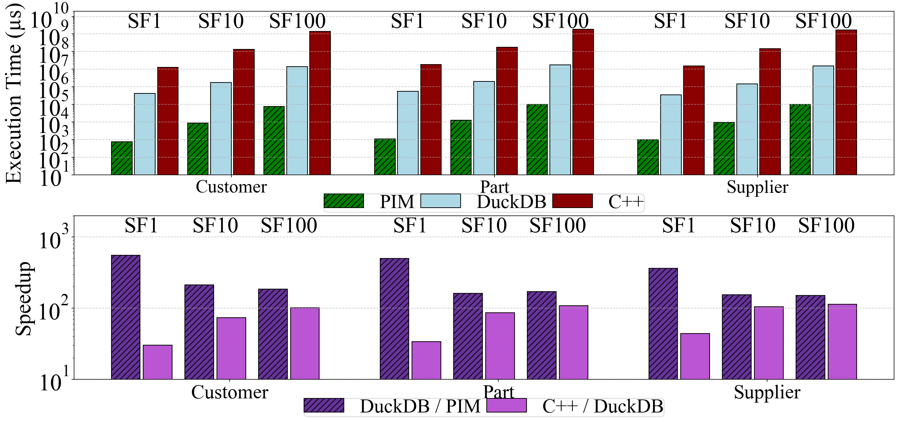

# Figure 7 with DuckDB unpinned

Figure 7's DuckDB series re-measured with **no `numactl`**: both sockets and
DuckDB's default 112 threads, the same setup as Figure 11's DuckDB bars. The
SPARQ and C++ series are unchanged.

| | Pinned | unpinned |
|---|---:|---:|
| SPARQ speedup over DuckDB | 312–620×, geomean 469× | **150–556×, geomean 239×** |
| DuckDB speedup over C++ | 28–51× | **30–113×** |



[`fig7_published.png`](fig7_published.png) is the published figure, rendered from
the full artifact's `figures_generation/Fig7.py`. PDFs of both are alongside.

## Setup

| | |
|---|---|
| machine | `cougar01`, 2 sockets × 28 cores × 2 threads, 8 DDR4 channels per socket |
| DuckDB | v1.1.3 (`/p/pd/newduckdb/duckdb`), default threads (112), no `numactl` |
| databases | SF1/SF10: local copies of `/p/pd/ssb_sf{1,10}.duckdb`; SF100: local copy of `/p/pd/duckdb_work/ssb_sf100.duckdb`; page cache warm |
| query | `COPY (SELECT * FROM lineorder l JOIN <dim> d ON <key>) TO '/dev/null' (FORMAT CSV)`, one fresh process per run |
| time | DuckDB's `Run Time (s): real` |
| runs | 3 at SF1/SF10, 2 at SF100; the median is plotted |
| date | 2026-09-16 |

The query, binary and databases are those of
`01-duckdb/scripts/corrected_baselines.sh` and `sf100_baselines.sh`, which pinned
DuckDB with `numactl --cpunodebind=0 --membind=0` and kept 112 threads.

## Results

DuckDB time in ms ([`results/fig7_free.csv`](results/fig7_free.csv)). SPARQ times
are from DRAMsim3 and unchanged.

| join | SPARQ | DuckDB Pinned | DuckDB unpinned | runs | SPARQ speedup, Pinned | SPARQ speedup, unpinned |
|---|--:|--:|--:|---|--:|--:|
| customer SF1 | 0.744 | 328 | 414 | 423, 404, 414 | 441× | 556× |
| customer SF10 | 8.47 | 4,726 | 1,791 | 1,768, 1,791, 1,795 | 558× | 211× |
| customer SF100 | 74.7 | 46,291 | 13,753 | 13,690, 13,817 | 620× | 184× |
| part SF1 | 1.08 | 436 | 541 | 545, 541, 541 | 405× | 502× |
| part SF10 | 12.4 | 5,473 | 2,012 | 2,012, 2,009, 2,016 | 441× | 162× |
| part SF100 | 101.3 | 55,760 | 17,346 | 17,343, 17,348 | 550× | 171× |
| supplier SF1 | 0.968 | 302 | 351 | 351, 349, 353 | 312× | 363× |
| supplier SF10 | 9.33 | 4,274 | 1,432 | 1,410, 1,432, 1,439 | 458× | 153× |
| supplier SF100 | 101.4 | 51,596 | 15,247 | 15,276, 15,218 | 509× | 150× |

With DuckDB unpinned, SF1 is 1.1–1.3× slower than Pinned, and SF10/SF100 are
2.6–3.4× faster.

## Why pinning matters

A shorter run of SF1/SF10, three modes alternating, two runs each
([`results/fig7_modes_sf1_sf10.csv`](results/fig7_modes_sf1_sf10.csv); seconds):

| join | no `numactl` | `--membind=1` | `--cpunodebind=1 --membind=1` |
|---|--:|--:|--:|
| customer SF10 | 1.77 | 1.85 | 3.20 |
| part SF10 | 2.03 | 2.14 | 3.31 |
| supplier SF10 | 1.44 | 1.47 | 2.69 |

At SF1 the three modes are within noise. Binding memory alone costs about 5%.
Confining the CPUs as well puts 112 threads on 56 cores and nearly doubles the
time. The pinned times match the earlier reproduction in `01-duckdb/`
(3.2/3.6/2.9 s).

## Limits

- **Published method unknown.** The script that produced Figure 7's DuckDB
  series was not found, and no original script calls `numactl`. The published
  SF10/SF100 values are slower even than pinned runs.
- **SF100 part key.** The SF100 database names `lineorder`'s part key `partkey`,
  so that join uses `l.partkey = d.partkey`, as `sf100_baselines.sh` does.
- **Font.** Rendered with the Times New Roman file that `Fig7.py`'s `!wget`
  downloads (`TNR_FONT`).

## Reproduce

```bash
bash scripts/fig7_free.sh                              # all SFs, unpinned
MODES="free mem1 pin1" OUT=/tmp/modes.csv bash scripts/fig7_free.sh 1 10
TNR_FONT=/path/TimesNewRoman.ttf bash scripts/render.sh Fig7.py fig7_updated.pdf
```

## Files

| | |
|---|---|
| `Fig7.py` | `figures_generation/Fig7.py` with only `duckdb_latencies` changed |
| `fig7_updated.{png,pdf}`, `fig7_published.{png,pdf}` | rendered with `scripts/render.sh` |
| `scripts/fig7_free.sh` | the measurement |
| `scripts/render.sh` | renders a `Fig7.py` without a display |
| `results/fig7_free.csv` | every unpinned run |
| `results/fig7_modes_sf1_sf10.csv` | the three-mode comparison |
